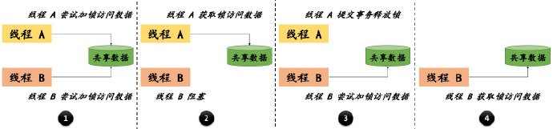
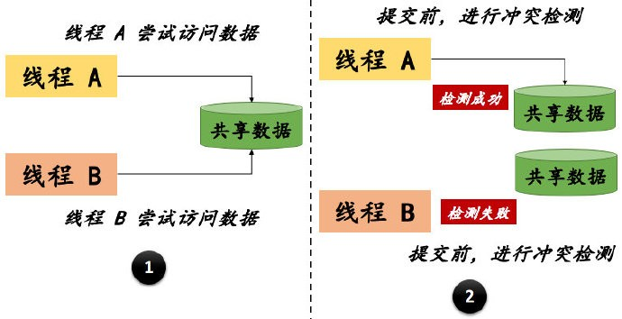

# 09 通过锁解决并发数据问题

数据库的锁机制是并发控制的重要内容，是对程序控制数据一致性的重要补充。单独提到 “锁” 这个概念，大家一定不会陌生，各种语言中都有对
“锁” 的实现。例如，我们在编写 Java 代码时，考虑到多线程并发访问共享数据，只要使用 synchronized 关键字，JVM 底层就可以保证线程安全。MySQL
的存储引擎（不同的存储引擎有不同的实现）对锁的实现也是类似的思想，这一节里，我将解读 MySQL 的悲观锁和乐观锁，包括概念解读、实现原理、使用方法、适用场景等等。

## 1 行级锁、表级锁的概念解读

悲观锁与乐观锁的概念是从应用的角度来看的，从数据库（InnoDB
存储引擎）的角度看，数据库锁可以分为行级锁和表级锁（通常称为行锁和表锁）。在学习它们的原理和使用方法之前，把它们的概念搞清楚是非常有必要的。

### 1.1 什么是行级锁

InnoDB 存储引擎支持行级锁和表级锁，默认情况下，使用行级锁。行级锁是 MySQL
中锁定粒度最细的一种锁，它锁住的是行记录。行级锁可以大大减少数据库操作的冲突，但是加锁的开销也是非常大的。它具有如下特点：

- 由于开销比较大，加锁会很慢
- 锁定粒度小，所以锁冲突的概率低，并发度高
- 可能会出现死锁

### 1.2 什么是表级锁

表级锁是 MySQL 中锁定粒度最大的一种锁，正如字面意思，它会锁住整张表。由于锁定粒度很大，它的实现会简单许多，资源消耗也会很低，不光是
InnoDB ，其他大部分的存储引擎也都支持表级锁，它具有如下特点：

- 由于开销比较小，加锁会很快
- 锁定粒度大，所以锁冲突的概率高，并发度低
- 不会出现死锁

可以看到，正是由于行级锁和表级锁的锁定范围不同，它们的特性正好是相反的。

### 1.3 MySQL 是怎样选择行级锁与表级锁的 ？

刚刚说过，InnoDB 存储引擎支持行和表级锁，那么，什么场景下会锁住行、什么场景下又会锁住表呢？把这个问题搞清楚了，也就基本上掌握了这两种锁，在实际的应用中，也就可以把握程序的性能了。

InnoDB 行级锁是通过给索引上的索引项加锁来实现的，所以，只有通过索引条件检索的数据，InnoDB 才会使用行级锁。否则，使用表级锁。总结下来：

- 不通过索引条件查询时，InnoDB 一定会使用表锁，而不是行锁（因为没有索引只能全表扫描）
- 查询时，不论是使用主键索引、唯一索引或者普通的索引，InnoDB 都会使用行锁来对数据加锁

但是，需要注意，对于第二条总结，在有些特殊情况下是不成立的。例如，对于数据量很少的表，MySQL 会认为全表扫描更快，此时，即使使用索引字段查询，InnoDB
也会使用表锁，而不是行锁。因此，如果想确定当前使用的是哪一种锁，检查下 SQL 的执行计划（EXPLAIN），确认是否在查询时使用了索引。

## 2 悲观锁、乐观锁的概念解读

从应用的角度来说，乐观并发控制与悲观并发控制是并发场景下保证数据一致性的主要方法。乐观锁和悲观锁的概念（思想）不仅仅应用在数据库层面，在编程语言、程序逻辑、ORM
框架中都有广泛的应用。

### 2.1 什么是悲观锁

首先，我们先来看一看悲观锁的定义：

> 当我们要对数据库中的一条数据进行修改的时候，为了避免同时被其他人修改，最好的办法就是直接对该数据进行加锁以防止并发。这种借助数据库锁机制在修改数据之前锁定，再修改的方式被称为悲观并发控制（PCC）。

这也就是这种锁被称为 “悲观”
的原因，它会以悲观的态度去对待并发的数据控制，认为共享数据被并发修改的可能性较高，在修改之前先去加锁。在实现效率上，处理加锁的过程会让数据库产生额外的开销，降低并发度，同时，还可能会有死锁的可能。

悲观锁的实现，依赖于数据库提供的锁机制（行级锁、表级锁）。它的工作流程可以总结如下：

- 对数据操作之前，尝试获取锁
- 获取锁成功，对数据进行修改、提交事务，最后释放锁
- 获取锁失败，则锁正在被占用，等待或抛出异常

最后，我用一张图来更清晰的表达悲观锁的工作流程。



### 2.2 什么是乐观锁

同样，我们也是先来看一看乐观锁的定义：

> 乐观锁是相对悲观锁而言的，乐观锁假设数据一般情况下不会造成冲突，所以在数据进行提交更新的时候，才会正式对数据的冲突与否进行检测。

从乐观锁的定义可以知道，它并不是真正意义上的
“锁”，所以，自然也就不会使用到数据库的锁机制。乐观（锁）并发控制认为事务之间的数据竞争概率比较低，因此在操作时不需要加锁，只是在提交时再做判断，它也不会产生死锁的情况。

下面，我也用一张图来更清晰的表达乐观锁的工作流程。



## 3 悲观锁、乐观锁的实现原理与使用方法

前面我们理解了悲观锁、乐观锁的理论知识，知道了它们的工作流程。下面，我们看一看怎样在 SQL 中实现它们。首先，还是以 worker
表为例，假设当前我们有如下的数据：

```bash

mysql> SELECT * FROM worker WHERE id < 4;
+----+------+------+--------+
| id | type | name | salary |
+----+------+------+--------+
| 1  | A    | tom  | 1800   |
| 2  | B    | jack | 2100   |
| 3  | C    | pony | NULL   |
+----+------+------+--------+
```

### 3.1 学会使用悲观锁

在 MySQL 中使用悲观锁，必须关闭 MySQL 的自动提交（MySQL 默认使用自动提交模式，即执行 INSERT、UPDATE、DELETE 时，结果自动生效），如下所示：

```bash

-- 关闭自动提交
mysql> SET autocommit = off;

-- 校验自动提交是否关闭
mysql> SHOW VARIABLES LIKE 'autocommit';
+---------------+-------+
| Variable_name | Value |
+---------------+-------+
| autocommit    | OFF   |
+---------------+-------+
```

MySQL 提供的悲观锁实现方式是：SELECT … FOR UPDATE。为了演示多线程操作，我们开启两个会话（注意，都需要关闭自动提交）。首先，看一看获取锁超时的情况：

```bash

-- “会话 A” 通过悲观锁语法锁住 id 为 1 的记录
mysql> SELECT * FROM worker WHERE id = 1 FOR UPDATE;
+----+------+------+--------+
| id | type | name | salary |
+----+------+------+--------+
| 1 | A | tom | 1800 |
+----+------+------+--------+

-- “会话 B” 也通过悲观锁语法锁住 id 为 1 的记录
-- 由于锁被 “会话 A” 占据，长时间获取不到锁，报了锁超时错误
mysql> SELECT * FROM worker WHERE id = 1 FOR UPDATE;
ERROR 1205 (HY000): Lock wait timeout exceeded; try restarting transaction
```

接下来，我们让 “会话 A” 更新被锁定记录的 salary 字段，并提交事务（在这个过程中，同时让 “会话 B” 尝试去获取锁），如下所示：

```bash

-- “会话 A” 更新记录
mysql> UPDATE worker SET salary = 2000 WHERE id = 1;
Query OK, 1 row affected (0.01 sec)
Rows matched: 1 Changed: 1 Warnings: 0

-- “会话 A” 提交事务
mysql> commit;
Query OK, 0 rows affected (0.02 sec)

-- “会话 B” 在 “会话 A” 提交事务之后，获取锁成功（观察 SQL 语句执行耗时）
mysql> SELECT * FROM worker WHERE id = 1 FOR UPDATE;
+----+------+------+--------+
| id | type | name | salary |
+----+------+------+--------+
| 1 | A | tom | 2000 |
+----+------+------+--------+
1 row in set (25.13 sec)
```

从以上执行过程可以看到，SELECT … FOR UPDATE
只允许一个事务获取到锁，其他的事务只能等待或者超时。所以，自然也就可以解决并发事务问题了。但是，在使用悲观锁的时候，一定需要注意使用索引，否则行锁将会上升为表锁，引起系统问题。

### 3.2 学会使用乐观锁

乐观锁其实是对 CAS（compare-and-swap）的实现：在做修改时，检查当前的环境是否与预定义的一致，如果一致则可以提交；否则，重试或抛异常。根据对这个实现思想的描述，我们可以简单地应用乐观锁：

```bash

-- 查询需要修改的记录，并把当前 salary 的值作为预定义的比对条件
mysql> SELECT * FROM worker WHERE id = 1;
+----+------+------+--------+
| id | type | name | salary |
+----+------+------+--------+
| 1 | A | tom | 2000 |
+----+------+------+--------+
1 row in set (0.00 sec)

-- 更新记录 salary 的值，并比对之前预定义的条件是否一致
mysql> UPDATE worker SET salary = 1800 WHERE id = 1 AND salary = 2000;
Query OK, 1 row affected (0.00 sec)
Rows matched: 1 Changed: 1 Warnings: 0

-- 比对一致，更新成功
mysql> SELECT * FROM worker WHERE id = 1;
+----+------+------+--------+
| id | type | name | salary |
+----+------+------+--------+
| 1 | A | tom | 1800 |
+----+------+------+--------+
1 row in set (0.00 sec)
```

以上就是最简单的乐观锁实现，但是，这里存在一个隐藏很深的问题：ABA。考虑这样一种情况：“线程 A” 在更新 salary 之前，“线程 B” 先将
salary 更新为2500，再将 salary 更新为 2000。此时，“线程 A” 则会认为 salary 没有发生变化，而实际的情况是，“线程 B” 对此更新了两次。

既然这种直接比较的方式不可信，我们可以想办法加入一个不会重复修改的值数据来作为版本号，即 version 参数，version
只能增加，不能减少。乐观锁在每次执行数据修改时，都需要去比对 version，如果一致，则更新数据的同时，也要更新 version。示例如下所示：

```bash

-- 给 worker 表添加 version 列
mysql> ALTER TABLE `worker` ADD COLUMN `version` BIGINT(20) NOT NULL DEFAULT '0' COMMENT '乐观锁版本号';
Query OK, 0 rows affected (0.18 sec)
Records: 0 Duplicates: 0 Warnings: 0

-- 读取数据，记录 version 的值
mysql> SELECT * FROM worker WHERE id = 1;
+----+------+------+--------+---------+
| id | type | name | salary | version |
+----+------+------+--------+---------+
| 1 | A | tom | 1800 | 0 |
+----+------+------+--------+---------+
1 row in set (0.00 sec)

-- 比对 version 是否符合预期，更新数据和 version
mysql> UPDATE worker SET salary = 2000, version = version + 1 WHERE id = 1 AND version = 0;
Query OK, 1 row affected (0.00 sec)
Rows matched: 1 Changed: 1 Warnings: 0

-- 再次读取数据，校验是否符合预期
mysql> SELECT * FROM worker WHERE id = 1;
+----+------+------+--------+---------+
| id | type | name | salary | version |
+----+------+------+--------+---------+
| 1 | A | tom | 2000 | 1 |
+----+------+------+--------+---------+
1 row in set (0.00 sec)
```

可以看到，乐观锁的思想比较简单，而且不会使用到真正的锁，实现效率很高。但是，乐观锁也并不是没有缺点的：当遇到高并发时，只可能会有一个线程修改成功，会造成大量的线程失败或重试。最后，补充一点，乐观锁同样可以使用时间戳来实现，一样的道理。

## 4 悲观锁、乐观锁的适用场景

不管是悲观锁还是乐观锁，其实都是人为定义的概念。它们都一定有各自的优缺点，也就自然会有不同的适用场景。下面，我们先来总结下它们的特性、优缺点，再去反推下它们的适用场景。

### 4.1 悲观锁、乐观锁的特性及优缺点

悲观锁是依赖于数据库（存储引擎）的，它的优缺点总结如下：

- 优点：利用锁机制保证了数据的顺序执行，不需要自己控制，加锁、释放完全由数据库代劳
- 缺点：一旦一个事务获取了锁，其他的事务必须等待，势必会影响系统的吞吐量

乐观锁不是真正的加锁，对其他事务友好，它的优缺点总结如下：

- 优点：由于不需要加锁，其他的事务可以同时操作数据，相比于悲观锁，系统吞吐量会提高
- 缺点：需要自行控制，如果并发度较高，失败重试的情况会成为系统瓶颈

正如它们的名字一样，悲观锁是一种悲观情绪，总是假设最坏的情况，每次读取数据时，都认为会被其他人修改，必须加上锁；乐观锁则是一种乐观情绪，总是假设最好的情况，每次读取数据时，都认为不会被其他人修改，而是在更新时做一次额外的判断。

### 4.2 悲观锁、乐观锁的合理应用

既然已经分析了悲观锁与乐观锁的优缺点，它们的适用场景也是显而易见的：

- 悲观锁的适用场景：写入操作比较频繁的场景，如果有大量的读取操作，每次读取都需要加锁，会增加锁开销，降低系统的吞吐量
- 乐观锁的适用场景：读取操作比较频繁的场景，如果有大量的写入操作，冲突的可能性会剧增，降低系统的吞吐量

## 5 总结

数据库的锁机制不仅仅在企业级开发中非常常用，它也是笔试、面试的高频考点，不过好在它比较容易理解。在学习时，除了对思想和原理的理解之外，也要在纸上画一画不同类型锁的执行流程，最后再去开启会话验证你的想法。

## 6 问题

你能给出一个行级锁升级为表级锁的案例吗（使用 worker 表或者你定义的表都可以）？

你能用 timestamp（时间戳）的方式实现乐观锁吗 ？

除了我这里的讲解，你是怎样看待 MySQL 中的锁机制呢（可以从锁粒度、锁应用的角度去思考） ？

## 7 参考资料

《高性能 MySQL（第三版）》

《MySQL技术内幕：InnoDB存储引擎》

MySQL 官方文档：InnoDB Locking: https://dev.mysql.com/doc/refman/5.7/en/innodb-locking.html


