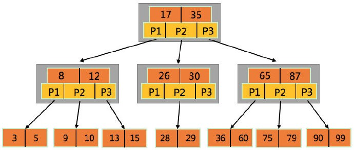

# 10 索引定义及其优化，你知道多少？

MySQL 最核心的三个知识点：索引、查询和事务，其中索引又会应用于查询，所以，理解并学会使用索引是学好 MySQL
的基础。这一节的内容不仅包含对索引概念、实现原理的讲解，也会包含对索引类型及使用优化建议的介绍。好的，下面开始我们的索引之旅吧。

## 1 索引概述

在解读索引（包括索引分类、原理等等）之前，我们先来简单的看一看索引的定义，也就是初步带你认识索引（千万别小看这个步骤，很多时候，需要你能够举出形象的例子来表达索引）。熟知了索引的概念之后，我们再去总结下索引的优缺点。可以看到，虽然还没真正接触到索引，我们就已经把索引的
“来龙去脉” 搞清楚了，这也是一种自顶向下的学习方法。

### 1.1 怎样理解索引

首先，我们来看一看 MySQL 对索引的定义：

> 索引是存储引擎用于快速找到记录的一种数据结构

需要捕捉到这句话的核心：索引是一种数据结构，而数据结构是用来表示数据的特定规则。一个常见而又简单的索引例子是书籍的目录，例如词典，我们想要在一本词典中查找一个单词，根据习惯，我们肯定会翻一翻目录，找到对应开头的单词，再去顺序查找等等类似的步骤，最终找到这个单词。如果没有目录，那么，除了顺序查找，别无他法。

现在，你应该理解索引和索引的 “功效” 了。下面，我们再来以 MySQL 表的例子来简单的看一看它的查找过程是怎样的。假设当前我们有
worker 表，数据如下：

```bash

mysql> SELECT name, salary FROM worker WHERE salary > 0;
+--------+--------+
| name   | salary |
+--------+--------+
| tom    |   1800 |
| jack   |   2100 |
| tony   |   3600 |
| marry  |   1900 |
| tack   |   1200 |
| clock  |   2000 |
| noah   |   1500 |
| jarvis |   1800 |
+--------+--------+
```

如果我想要查询 salary = 2000 的员工有哪些，最简单的就是遍历所有的数据做比较，这样的时间复杂度是 O(n) 量级。但是如果 MySQL
维护了一个 salary 的有序数组：[1200, 1500, 1800, 1800, 1900, 2000, 2100, 3600]，就可以将查询过程优化为二分查找，此时的时间复杂度将降为
O(logn)。而这个有序数组也就对应到索引的概念了（MySQL 中使用的索引并不是有序数组，后面会详细的分析讲解）。

### 1.2 索引的优缺点

根据之前对索引概念的描述，我们应该可以知道，索引就是用来加快数据检索的，且数据量越大这种速度的提升就会越明显。这里，我们去对索引的优点和缺点做个总结，完成对索引的特性认知。

索引的优点：

- 减少扫描的数据量，加速查询
- 减少或完全消除数据库的排序操作（ORDER BY），因为索引是有序的
- 将服务器的随机 IO 变为顺序 IO，例如，想要查询 salary 处于 1500 ~ 2100 的员工，就可以按照索引顺序查询

索引的缺点：

- 索引会占据额外的存储空间（毕竟它是数据结构），包括磁盘和内存
- 由于对数据需要排序，自然会影响到数据更新（插入、更新、删除）的速度

几乎任何技术或优化都具有两面性，有优点，自然也就会有缺点。所以，索引虽好，不要滥用。一定要在足够理解索引和业务的基础之上再去选择创建索引、使用索引。

## 2 索引实现原理及分类

之前说到的有序数组索引只是示例，MySQL 的索引实现要比它复杂很多。同时，SQL 标准还定义了索引的类别，理解索引的实现原理以及类别才能够做出正确的选择，达到事半功倍的效果。

### 2.1 索引实现原理

关于索引实现，这里其实有个误区：对于 MySQL 来说，服务器层并不会实现索引，而是交给了存储引擎。所以，你应该知道了，不同的存储引擎自然也就会有各自不同的实现。对于
InnoDB 而言，它的内部实现使用的是 B+ 树。

树这种数据结构学习起来，难度是比较高的，所以，我们在工作和面试中遇到的情况不多。B+ 树是对 B 树的改进得到的，而 B
树则是一棵多路平衡查找树（是平衡二叉树的变体，稍有不同的是 B 树属于多叉树，即查找路径不止两个）。所以，想要搞清楚 B+ 树，就一定要搞清楚
B 树。首先，我们来谈一谈 M 阶（着重理解 M 的概念，M 阶代表一个节点最多有多少个查找路径）的 B 树具有哪些性质：

- 根节点至少有两个子节点
- 每个节点包含 k - 1 个元素和 k 个子节点，其中 m/2 <= k <= m（元素是存储的数据）
- 每个叶子节点都包含 k - 1 个元素，且位于同一层，其中 m/2 <= k <= m
- 每个节点中的元素从小到大排列，类似于一个有序数组

如下图所示，就是一棵 B 树的存储示例（根据以上对 B 树的描述，你知道这是一棵几阶 B 树吗 ？）。



B+ 树是在 B 树之上改进得到的，它又添加了两项约束（完全包含 B 树的约束）：

- 除叶子节点之外的其他节点都不保存数据，所以，数据在同一层
- 叶子节点之间按照排列顺序链接在一起，形成了一个有序链表

同样，我也给出一棵 B+ 树的存储示例。


我们对数据表列创建的索引，在底层的实现中也基本就是这个样子。那么，根据当前你对 B+ 树索引的理解，你知道查询 105 的路径是怎样的吗
？110 呢（不存在这个数据）？

最后，我们再来讨论一个问题，为什么 InnoDB 会选用 B+ 树作为索引数据结构呢 ？

- 中间节点不保存真实数据，就可以去存储更多的索引数据，以降低整体树的层级，减少磁盘 IO 的次数，提高查询性能
- 所有的数据都保存在叶子节点，查询的次数也就是相同的，查询稳定性很高
- 叶子节点之间顺序链接在一起，范围查询的效率极高

### 2.2 索引分类

在定义数据表时，我们可以根据业务需要创建索引以加速查询过程。而创建的索引又可以分为很多类，常见的有：普通索引、主键索引、唯一索引和联合索引。下面，我们来看看这几类索引（为了讲解方便，不按照列出的顺序介绍）。

- 普通索引：针对于单个列创建的索引，之所以说它普通是因为它对列值没有什么限制，允许被索引的列包含重复的值
- 唯一索引：正如它的关键字一样，它要求列值是唯一的，这个索引保证了数据记录的唯一性
- 主键索引：它是一种特殊的唯一索引，在一张表中只能定义一个（但不是必须）主键索引
- 联合索引：也被称为复合索引，它是将多个列值绑定在一起作为索引

需要知道，索引的分类是存在交叉的。唯一索引和主键索引也可以针对多个列做索引，即它们可以是联合索引。学习的目的在于理解，理解的目的在于应用，可以参考你当前的业务表，看看它们都定义了哪些索引，并思考下为什么要这样做 ？

## 3 创建高性能的索引

优化查询与优化索引是相辅相成的，所以，学会创建高性能的索引是数据库优化必备技能，也几乎是面试中的必考题。但是，也需要理解，思想和理论并不是一成不变，哪里都适用的。应该是贴合自己的业务需求，再做判断和选择。

### 3.1 聚簇索引

聚簇索引是 InnoDB 中一个最为特殊的概念，它实际上并不是一种索引类型，而是一种存储数据的方式，且是将索引和数据存储在一起。InnoDB
规定一个表只能有一个聚簇索引，且会使用主键来创建。即使是创建表时没有指定主键（MySQL 允许这样做），InnoDB 也会挑选唯一非空列或使用隐式的
“主键” 来进行聚簇索引。之所以这样做的原因也很简单，因为数据表中的数据总是需要排序存储到磁盘上。

说到这里，你应该也就明白了为什么 InnoDB 推荐使用自增的（int 或 bigint
类型）主键。因为自增主键的连续增长特性，插入数据时只需要向后追加即可，效率非常高。倘若使用字符型的主键，那么，每一次插入数据，不仅需要找到主键的位置，还需要移动主键位置后的数据（可能会造成
B+ 树的分裂、合并），这简直就是噩梦。

既然数据表只有一个聚簇索引，那么，所有其他的索引就应该是 “非聚簇索引”，它们的区别又是什么呢
？对于聚簇索引来说，索引即数据，所以，如果以主键去查询数据，那么只需要一次索引查找即可。对于非聚簇索引而言，实际存储的是记录主键，所以，还需要根据主键再做一次查询才可以获取到数据，这也就是我们通常所说的
“非主键的二次查询”。

### 3.2 联合索引

在介绍索引分类的时候就已经说过联合索引了，它的应用场景是多列 WHERE 查询。例如，对于 worker 表，我们需要做这样的查询：

```bash

SELECT * FROM worker WHERE type = 'B' AND salary > 2000;
```

此时，我们不要去单独的创建 type 和 salary 索引，而应该创建 (type, salary) 的联合索引（可以思考下，联合索引的 B+ 树存储是怎样的呢
？），语句如下：

```bash

mysql> ALTER TABLE worker ADD INDEX type_salary_idx(`type`, `salary`);
Query OK, 0 rows affected (0.11 sec)
Records: 0 Duplicates: 0 Warnings: 0
```

worker 表添加了联合索引之后，再去查询时就会使用到 type_salary_idx（索引的名称，可以随意）。同时，联合索引会遵循最左前缀匹配原则，也就是常说的
“最左优先原则”。它的表现形式是在检索数据时从联合索引的最左边开始匹配。举个例子：我现在给 worker 添加如下索引：

```bash

mysql> ALTER TABLE worker ADD INDEX type_salary_name_idx(`type`, `salary`, `name`);
Query OK, 0 rows affected (0.07 sec)
Records: 0 Duplicates: 0 Warnings: 0
```

可以认为，MySQL 一共创建了三个索引：(type)，(type, salary)，(type, salary, name)。那么，你应该也明白了之前创建的
type_salary_idx 索引是多余的。联合索引是一个比较有意思的话题，你需要充分理解它的 “最左原则”，这会让你避免创建冗余的索引。另外，你还需要知道一些索引失效的条件：

- 在索引列上执行计算、函数、类型转换等操作
- 使用不等于（!= 或 <>）
- 使用 IS NULL，IS NOT NULL
- LIKE 以通配符（%）开头，例如：%tom

除了基本的原则之外，MySQL 还会对查询语句做优化处理，它会重新编排 SQL 中的条件匹配顺序，例如如下的两条查询语句：

```bash

SELECT * FROM worker WHERE type = 'B' AND salary > 2000;
SELECT * FROM worker WHERE salary > 2000 AND type = 'B';
```

也许你会认为第二条 SQL 语句不能使用到索引，但事实却不是这样的，它与第一条查询语句是相同的，MySQL 优化器会按照 SQL
的语义重新编排列顺序，目的就是能够使用索引优化查询。

### 3.3 前缀索引

当表中的数据列是字符型，且大多数长度都比较长时，就可以考虑使用列值的一部分前缀作为索引，这也就被称作是前缀索引。但是，这里有一个疑问：只选取字符串的部分信息作为索引，查询的效率还会有很大提升吗
？这其实就是个列值选择度的问题。举个例子，假如我们有张表的一列存储国家的名字，对于列值 “中华人民共和国”
就可以使用前两个字完成匹配。那么，如果使用前两个字建立索引，可以节省 70% 的索引空间。建立前缀索引的语法是：

```bash

ALTER TABLE table_name ADD KEY(column_name(prefix_length));
```

列值的前半部分当然可能重复度很高，所以，遇到这种情况，就需要把前缀截取的 “稍微长一些”（也就是 prefix_length 的值大一些），在
MySQL 中专业的叫法是 “索引选择性”（Index Selectivity）。索引选择性是一个数值，它等于 不重复的值 /
所有的值，取值范围介于0到1。1就是代表这一列唯一，没有重复的值。且这个值是可以计算得到的，例如，我想看一看 worker 表 name
列（数据类型是 char(64)）的索引选择性：

```bash

mysql> SELECT 1.0 * COUNT(DISTINCT name) / COUNT(*) FROM worker;
+---------------------------------------+
| 1.0 * COUNT(DISTINCT name) / COUNT(*) |
+---------------------------------------+
| 1.00000                               |
+---------------------------------------+
```

得到的结果是1，我们要给 name 字段建立前缀索引，目标就是能够尽量贴近于对整个字段建立索引时的选择性。最直接的办法就是不断的尝试，步骤如下所示：

```bash

-- 选取一个字符作为前缀索引，结果是 0.6，这个值比较低
mysql> SELECT 1.0 * COUNT(DISTINCT LEFT(name, 1)) / COUNT(*) FROM worker;
+------------------------------------------------+
| 1.0 * COUNT(DISTINCT LEFT(name, 1)) / COUNT(*) |
+------------------------------------------------+
| 0.60000                                        |
+------------------------------------------------+

-- 选取两个字符作为前缀索引，结果是 0.8，选择性有所提高
mysql> SELECT 1.0 * COUNT(DISTINCT LEFT(name, 2)) / COUNT(*) FROM worker;
+------------------------------------------------+
| 1.0 * COUNT(DISTINCT LEFT(name, 2)) / COUNT(*) |
+------------------------------------------------+
| 0.80000                                        |
+------------------------------------------------+

-- 选取三个字符作为前缀索引，结果是1
mysql> SELECT 1.0 * COUNT(DISTINCT LEFT(name, 3)) / COUNT(*) FROM worker;
+------------------------------------------------+
| 1.0 * COUNT(DISTINCT LEFT(name, 3)) / COUNT(*) |
+------------------------------------------------+
| 1.00000                                        |
+------------------------------------------------+
```

最终，我们可以确定，前缀长度为3的时候，占据的存储空间最小，且查询效率最高。另外，需要说明，前缀的索引选择性接近于整体选择性就可以，并不一定需要等于。

### 3.4 覆盖索引

覆盖索引的 “出场率” 不是很高，但是非常重要。当一个索引包含需要查询的所有字段时，就称之为覆盖索引。这个概念听上去并不是很好理解，我们举例来说明：假设当前
worker 表有一个索引项是 (type, salary)，我们做如下查询：

```bash

SELECT type, salary FROM worker WHERE type = 'B'
```

在讲解聚簇索引时提到：如果不通过聚簇索引查询，则需要查询两次。但是，由于索引中已经包含了当前需要查询的两列，就不需要再回数据库查询了，也就是说索引覆盖了数据。通常情况下，索引数据的量级会比真实数据的量级小很多，覆盖索引能够大大的减少从磁盘加载的数据量，也是比较高级的优化手段。

看起来覆盖索引似乎是比较简单的，但是这是建立在你足够理解业务的基础之上，能够建立合适且不冗余的索引。

## 4 索引元数据

之前的内容就已经把索引讲解清楚了，更多的是偏向于理论，直观感受不强烈。接下来，我们来看一看索引的元数据信息（MySQL
对索引的统计信息），直观的感受下索引。

### 4.1 查看表索引信息

对于任意一张数据表，我们怎么知道在它上面建了哪些索引呢 ？MySQL 提供了两种方式：

```bash

-- 第一种方式：使用 SHOW INDEX FROM TABLE_NAME 语句查看表上的索引
mysql> SHOW INDEX FROM WORKER;
+--------+------------+----------------------+--------------+-------------+-----------+-------------+----------+--------+------+------------+---------+---------------+
| Table  | Non_unique | Key_name             | Seq_in_index | Column_name | Collation | Cardinality | Sub_part | Packed | Null |Index_type  | Comment | Index_comment |
+--------+------------+----------------------+--------------+-------------+-----------+-------------+----------+--------+------+------------+---------+---------------+
| worker | 0          | PRIMARY              | 1            | id          | A         | 10          | NULL     | NULL   |      | BTREE      |         |               |
| worker | 1          | type_salary_idx      | 1            | type        | A         | 3           | NULL     | NULL   |      | BTREE      |         |               |
| worker | 1          | type_salary_idx      | 2            | salary      | A         | 10          | NULL     | NULL   | YES  | BTREE      |         |               |
| worker | 1          | type_salary_name_idx | 1            | type        | A         | 3           | NULL     | NULL   |      | BTREE      |         |               |
| worker | 1          | type_salary_name_idx | 2            | salary      | A         | 10          | NULL     | NULL   | YES  | BTREE      |         |               |
| worker | 1          | type_salary_name_idx | 3            | name        | A         | 10          | NULL     | NULL   |      | BTREE      |         |               |
+--------+------------+----------------------+--------------+-------------+-----------+-------------+----------+--------+------+------------+---------+---------------+

-- 第二种方式：使用 SHOW CREATE TABLE TABLE_NAME 查看建表语句，其中包含创建索引的语句
mysql> SHOW CREATE TABLE worker\G
*************************** 1. row ***************************
Table: worker
Create Table: CREATE TABLE `worker` (
    `id` bigint(20) unsigned NOT NULL AUTO_INCREMENT COMMENT 'id',
    `type` char(64) NOT NULL DEFAULT '' COMMENT '员工类型',
    `name` char(64) NOT NULL,
    `salary` bigint(20) unsigned DEFAULT NULL,
    `version` bigint(20) NOT NULL DEFAULT '0' COMMENT '乐观锁版本号',
    PRIMARY KEY (`id`),
    KEY `type_salary_idx` (`type`,`salary`),
    KEY `type_salary_name_idx` (`type`,`salary`,`name`)
) ENGINE=InnoDB AUTO_INCREMENT=17 DEFAULT CHARSET=utf8 COMMENT='员工表'
```

### 4.2 查看索引占据的空间大小

索引是一种数据结构，它就当然会占据空间。MySQL 会统计服务器中所有表、库的索引空间，并存储于系统表
information_schema.TABLES（这张表不仅存储了索引信息，也存储其他主题的信息，这里暂不讨论） 中。例如：我们可以通过如下语句查看
MySQL 服务器所有索引占据的空间（SQL 语句的解释可以参考注释信息）：

```bash

-- CONCAT、ROUND、SUM 都是函数，其中：CONCAT 用于将多个字符串连接成一个字符串；ROUND 用于对查询结果进行四舍五入，可以指定小数位数；SUM用来在不同记录中计算某一字段的加和
-- index_length 是 information_schema.TABLES 表中的列，标识索引长度，单位默认是字节
mysql> SELECT CONCAT(ROUND(SUM(index_length) / (1024*1024), 2), ' MB') FROM information_schema.TABLES;
+---------------------------------------------------------+
| CONCAT(ROUND(SUM(index_length) / (1024*1024), 2), ' MB')|
+---------------------------------------------------------+
| 0.26 MB                                                 |
+---------------------------------------------------------+
```
另外，information_schema.TABLES 表中 TABLE_SCHEMA 列代表库名、TABLE_NAME 列代表表名。所以，我们可以单独查询一个库或一个表占据的索引空间（多个的情况也可以）：
```bash

mysql> SELECT
    ->     CONCAT(ROUND(SUM(index_length) / (1024*1024), 2), ' MB')
    ->   FROM
    ->     information_schema.TABLES
    ->   WHERE
    ->     TABLE_SCHEMA = 'imooc_mysql';
+----------------------------------------------------------+
| CONCAT(ROUND(SUM(index_length) / (1024*1024), 2), ' MB') |
+----------------------------------------------------------+
| 0.03 MB                                                  |
+----------------------------------------------------------+

mysql> SELECT
    ->     CONCAT(ROUND(SUM(index_length) / (1024*1024), 2), ' MB')
    ->   FROM
    ->     information_schema.TABLES
    ->   WHERE
    ->     TABLE_SCHEMA = 'imooc_mysql'
    ->     AND TABLE_NAME = 'worker';
+----------------------------------------------------------+
| CONCAT(ROUND(SUM(index_length) / (1024*1024), 2), ' MB') |
+----------------------------------------------------------+
| 0.03 MB                                                  |
+----------------------------------------------------------+
```
## 5 总结
索引的重要程度毋庸置疑，可以说，你在使用 MySQL
的过程中，有一半的时间都在于索引打交道。那么，它自然也就成了面试中的常客，可以有各种问题对你狂轰乱炸。但是，抓住主线，梳理好逻辑，理解的同时再多去应用，逐渐的你会发现，其实索引，也可以很简单。

## 6 问题
根据我对 B 树的描述，再加上你的理解，你知道图中的 B 树是几阶的吗 ？

你能举一个联合索引建立 B+ 树的例子吗 ？

根据你的理解，你能说说哪些列（不仅仅是数据类型需要是字符型，还要关注列值）适合前缀索引吗 ？

你平时是怎样建立、使用索引的，为什么要这样做呢 ？

## 7 参考资料
《高性能 MySQL（第三版）》

《MySQL技术内幕：InnoDB存储引擎》

MySQL 官方文档：CREATE INDEX Statement: https://dev.mysql.com/doc/refman/5.7/en/create-index.html

MySQL 官方文档：Optimization and Indexes: https://dev.mysql.com/doc/refman/5.7/en/optimization-indexes.html

