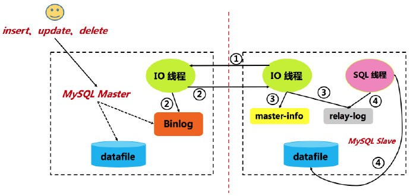

# 22 binlog 实现增量数据收集方案的设计

你在阅读这一节之前，应该对 Binlog（对于字母的大小写直接忽略即可）有基本的了解了，因为我已经不止一次的提到它了。Binlog
真的非常重要，对于 MySQL 运维来说，我们可以使用它来完成数据恢复；对于服务集群来说，我们需要 Binlog 实现主从同步。而这一节里，我将要带你认识：使用
Binlog 来实现增量数据的收集。

## 1. 业务场景概述

很多人看到标题中的 “增量数据”
其实并不知道它代表的是什么，这很正常，如果我之前没有做过或遇到过，大概率我也不知道它是什么。但是，当我说完它的概念之后，也许你会发现，这在业务系统中出现的频率很高，这同时也是我设计这一节的初衷。好的，下面一起来看看吧。

### 1.1 什么是增量数据

在说明增量数据之前，我们先要知道一个概念：全量数据。全量数据并不是说业务系统中所有的数据，而是说初始数据。下面，我以广告系统业务来说明这两个概念。

广告系统必须要有的数据包括：推广计划、推广单元和创意（你可以发散为其他业务系统中的数据，这并不重要）。在广告系统上线之前，这些数据必须是具备的，否则，线上没有数据就没有意义了。而这些上线之前就已经准备好的数据，就被称作是初始数据，也叫做全量数据。系统在运行过程中，必然会存在新数据插入、老数据更新或删除，而这些引起全量数据变动的数据就被称为增量数据。

为了加速系统的运行性能，我们通常会使用缓存或索引的策略，那么，一旦原始（全量）数据发生变动，缓存或索引数据同样需要变化。此时，就需要一种能够收集增量数据的方案。

### 1.2 初步解决方案及其存在的问题

我们首先能够想到的解决方案是：在数据发生变化的地方做收集，再使用收集到的数据做其他的更新（缓存或索引）操作。这种方式是最简单且可行的方案，但是，它存在严重的弊端。

- 数据发生变动的地方包括插入、更新和删除，假设由三个方法维护这三个操作，那么，收集增量数据的过程需要写：（表的个数）*
  3，会产生大量的重复代码
- 代码的每一次重复都是一次耦合，一旦涉及改动，同样需要改动很多次

正是由于代码耦合，维护困难的问题，才产生了收集日志的思想。但是，这里所说的日志只是业务系统日志，而不是 Binlog
日志。我们可以收集系统日志，确定增量数据，并最终完成缓存或索引的更新操作，这也类似于流式计算。但是，这种实现方式难度较大，也并不容易调试代码逻辑的正确性，实际的企业级开发中很少采用。

## 2. Binlog 解读

之前对 Binlog 的介绍是比较 “浅薄” 的，基本应用（数据同步、数据备份与恢复）肯定是没问题了。但是，对于增量数据的收集来说，就必须要理解
Binlog 的相关数据结构和特性。下面，我们就来详细的对 Binlog 进行解读。

### 2.1 DDL 与 DML

DDL 是 SQL 语言的四大功能之一，它的全称是 “Data Definition
Language”，即数据定义语言。它用于定义数据库的三级结构，包括外模式、概念模式、内模式，以及定义数据的完整性、安全控制等约束。DDL
最大的特点是，它不需要 COMMIT。DDL 语句包含：CREATE、ALTER、DROP、TRUNCATE 等等。

DML 的全称是 “Data Manipulation Language”，即数据操纵语言。它由 DBMS 提供给用户或工程师使用，实现对数据库中数据的操作，它需要
COMMIT。DML 语句包含：SELECT、INSERT、UPDATE、DELETE、CALL、EXPLAIN PLAN 等等。

MySQL 的 Binlog 会记录所有的 DDL 和 DML（除了不改变数据的语句，例如 SELECT、SHOW 等等）语句。它会以事件的形式记录，包含语句执行所消耗的时间，且是事务安全的。

### 2.2 数据表列的编码

我们定义数据表时只是指定了数据列的名称，但是对于 MySQL 来说，它又做了一次优化（分析 Binlog
日志时，会看到这种优化的目的）：对数据表列进行编码。我们先来看一看 worker 表的结构：

```bash

+---------+---------------------+------+-----+---------+----------------+
| Field   | Type                | Null | Key | Default | Extra          |
+---------+---------------------+------+-----+---------+----------------+
| id      | bigint(20) unsigned | NO   | PRI | NULL    | auto_increment |
| type    | char(64)            | NO   | MUL |         |                |
| name    | char(64)            | NO   | UNI | NULL    |                |
| salary  | bigint(20) unsigned | YES  |     | NULL    |                |
| version | bigint(20)          | NO   |     | 0       |                |
+---------+---------------------+------+-----+---------+----------------+
mysql> DESC worker;
5 rows in set (0.01 sec)
```

那么，对于 worker 表的每一列，MySQL 都会使用数字进行编码，而这个信息当然是存储在系统表（是数据库的元数据）中。想要获取这个编码，需要查询
information_schema.COLUMNS 表：

```bash

mysql> SELECT
    ->     table_schema,
    ->     table_name,
    ->     column_name,
    ->     ordinal_position
    ->   FROM
    ->     information_schema.COLUMNS
    ->   WHERE
    ->     table_schema = 'imooc_mysql'
    ->     AND table_name = 'worker';
+--------------+------------+-------------+------------------+
| table_schema | table_name | column_name | ordinal_position |
+--------------+------------+-------------+------------------+
| imooc_mysql  | worker     | id          |                1 |
| imooc_mysql  | worker     | type        |                2 |
| imooc_mysql  | worker     | name        |                3 |
| imooc_mysql  | worker     | salary      |                4 |
| imooc_mysql  | worker     | version     |                5 |
+--------------+------------+-------------+------------------+
5 rows in set (0.01 sec)
```

其中，ordinal_position 列标识的就是数据表列的编码（或者是位于表的位置）。了解这个编码是非常有必要的，因为在将来你会看到
Binlog 记录的并不是数据列名称，而是编码。

### 2.3 Binlog 中的事件类型

MySQL Binlog 记录的所有操作都会有事件类型与之对应，且不同的 Binlog 格式（ROW、STATEMENT 等）会有不同的事件类型，但是，基本上是类似的。下面，我以最常见的
ROW 格式去对必须要掌握的事件类型做介绍。当然，首先你需要确定你的 Binlog 格式：

```bash

mysql> SHOW VARIABLES LIKE 'binlog_format';
+---------------+-------+
| Variable_name | Value |
+---------------+-------+
| binlog_format | ROW   |
+---------------+-------+
1 row in set (0.01 sec)
```

对于 ROW 格式的 Binlog 来说，所有的 DML（由于我们这里讨论的是数据变动，所以，不对 DDL 做深入讲解）操作都会记录在 ROWS_EVENT
中。ROWS_EVENT 包含三种：UPDATE_ROWS_EVENT、WRITE_ROWS_EVENT 以及 DELETE_ROWS_EVENT。它们分别代表：

- **UPDATE_ROWS_EVENT**：对应 UPDATE 操作，Binlog 中不仅包含了修改后的数据，还包含了修改前的数据
- **WRITE_ROWS_EVENT**：对应 INSERT 操作，Binlog 中记录了被插入的数据
- **DELETE_ROWS_EVENT**：对应 DELETE 操作，Binlog 中记录了被删除的数据

另外，对应每一个 ROWS_EVENT 事件之前都会有一个 TABLE_MAP_EVENT，用于描述操作表的相关信息，例如：表名和所在的库。

## 2.4 查看 Binlog 日志

MySQL 提供了两种方式用于查看 Binlog 日志：第一种是 mysqlbinlog 工具；第二种是 SHOW BINLOG EVENTS 命令。为了方便查看 Binlog
日志，我们先去 “制造” 一些 Binlog。过程如下：

```bash

-- 切换 worker 表所在的库
mysql> USE imooc_mysql
Database changed

-- 刷新 Binlog 日志，自此刻开始产生一个新编号的 Binlog 日志文件
mysql> FLUSH LOGS;
Query OK, 0 rows affected (0.10 sec)

-- 向 worker 表中插入一条数据
mysql> INSERT INTO `worker` (`type`, `name`, `salary`, `version`) VALUES ('C', 'app', 3200, 0);
Query OK, 1 row affected (0.02 sec)

-- 更新刚刚插入的数据
mysql> UPDATE worker SET version = 1 WHERE name = 'app';
Query OK, 1 row affected (0.03 sec)
Rows matched: 1  Changed: 1  Warnings: 0

-- 删除之前插入的数据
mysql> DELETE FROM worker WHERE name = 'app';
Query OK, 1 row affected (0.02 sec)

-- 查看最新的 Binlog 日志编号名称
mysql> SHOW MASTER STATUS;
+------------------+----------+--------------+------------------+-------------------+
| File             | Position | Binlog_Do_DB | Binlog_Ignore_DB | Executed_Gtid_Set |
+------------------+----------+--------------+------------------+-------------------+
| mysql-bin.000007 |     1406 |              |                  |                   |
+------------------+----------+--------------+------------------+-------------------+
1 row in set (0.00 sec)
```

我们最近的操作过程当然会保存在最新的 Binlog 日志文件中（确保你打开了 Binlog 日志的开关），且由于之前做了 FLUSH
操作，mysql-bin.000007 的日志内容会相对比较干净。

首先，我们使用 mysqlbinlog 工具来查看 Binlog 日志（由于内容过多，忽略了部分信息，且包含详细的注释解读）：

```bash

# 在命令行终端执行 mysqlbinlog 命令，且需要指定 Binlog 的绝对路径（可能需要 root 权限）
➜  ~ mysqlbinlog /usr/local/mysql-5.7.28-macos10.14-x86_64/data/mysql-bin.000007 -vv --base64-output=decode-rows
......
BEGIN
/*!*/;
# 第一个 TABLE_MAP_EVENT 事件，标识了操作的库是 imooc_mysql，表是 worker
#191217 22:16:56 server id 1  end_log_pos 667 CRC32 0x8202e611 	Table_map: `imooc_mysql`.`worker` mapped to number 125
# WRITE_ROWS_EVENT 事件，标识插入数据
#191217 22:16:56 server id 1  end_log_pos 733 CRC32 0x86b8ede7 	Write_rows: table id 125 flags: STMT_END_F
# 插入数据的 INSERT 语句，注意，其中没有出现数据列的名称，取而代之的是数字编码
### INSERT INTO `imooc_mysql`.`worker`
### SET
###   @1=12 /* LONGINT meta=0 nullable=0 is_null=0 */
###   @2='C' /* STRING(192) meta=65216 nullable=0 is_null=0 */
###   @3='app' /* STRING(192) meta=65216 nullable=0 is_null=0 */
###   @4=3200 /* LONGINT meta=0 nullable=1 is_null=0 */
###   @5=0 /* LONGINT meta=0 nullable=0 is_null=0 */
# at 733
#191217 22:16:56 server id 1  end_log_pos 764 CRC32 0xce7dcbdf 	Xid = 5418
# 提交事务
COMMIT/*!*/;  
......
BEGIN
/*!*/;
# 第二个 TABLE_MAP_EVENT 事件，标识了操作的库是 imooc_mysql，表是 worker
#191217 22:17:57 server id 1  end_log_pos 972 CRC32 0x9fa15481 	Table_map: `imooc_mysql`.`worker` mapped to number 125
# UPDATE_ROWS_EVENT 事件，标识更新数据
#191217 22:17:57 server id 1  end_log_pos 1070 CRC32 0x800714cc 	Update_rows: table id 125 flags: STMT_END_F
# 更新数据的 UPDATE 语句，注意，包含了原始数据与更新数据
### UPDATE `imooc_mysql`.`worker`
### WHERE
###   @1=12 /* LONGINT meta=0 nullable=0 is_null=0 */
###   @2='C' /* STRING(192) meta=65216 nullable=0 is_null=0 */
###   @3='app' /* STRING(192) meta=65216 nullable=0 is_null=0 */
###   @4=3200 /* LONGINT meta=0 nullable=1 is_null=0 */
###   @5=0 /* LONGINT meta=0 nullable=0 is_null=0 */
### SET
###   @1=12 /* LONGINT meta=0 nullable=0 is_null=0 */
###   @2='C' /* STRING(192) meta=65216 nullable=0 is_null=0 */
###   @3='app' /* STRING(192) meta=65216 nullable=0 is_null=0 */
###   @4=3200 /* LONGINT meta=0 nullable=1 is_null=0 */
###   @5=1 /* LONGINT meta=0 nullable=0 is_null=0 */
# at 1070
#191217 22:17:57 server id 1  end_log_pos 1101 CRC32 0x202d0acb 	Xid = 5421
# 提交事务
COMMIT/*!*/;
......
BEGIN
/*!*/;
# 第三个 TABLE_MAP_EVENT 事件，标识了操作的库是 imooc_mysql，表是 worker
#191217 22:18:20 server id 1  end_log_pos 1309 CRC32 0x5d6dd698 	Table_map: `imooc_mysql`.`worker` mapped to number 125
# DELETE_ROWS_EVENT 事件，标识删除数据
#191217 22:18:20 server id 1  end_log_pos 1375 CRC32 0x11caf39d 	Delete_rows: table id 125 flags: STMT_END_F
# 删除数据的 DELETE 语句
### DELETE FROM `imooc_mysql`.`worker`
### WHERE
###   @1=12 /* LONGINT meta=0 nullable=0 is_null=0 */
###   @2='C' /* STRING(192) meta=65216 nullable=0 is_null=0 */
###   @3='app' /* STRING(192) meta=65216 nullable=0 is_null=0 */
###   @4=3200 /* LONGINT meta=0 nullable=1 is_null=0 */
###   @5=1 /* LONGINT meta=0 nullable=0 is_null=0 */
# at 1375
#191217 22:18:20 server id 1  end_log_pos 1406 CRC32 0xea1085f6 	Xid = 5422
# 提交事务
COMMIT/*!*/;
......
```

从以上对 Binlog 的解读可以看出：虽然 Binlog 记录的信息表现得很 “繁琐”，但是，理解了它的事件记录策略，阅读起来也并没有很大的难度。同时，MySQL
还提供了更加简单的方式去查看 Binlog。如下所示：

```bash

-- 再次刷新一个新的 Binlog 日志文件
mysql> FLUSH LOGS;
Query OK, 0 rows affected (0.09 sec)

-- 设置 binlog_rows_query_log_events 参数，用于输出原生的 DML 语句（如果不设置，不能显示 SQL 语句）
mysql> SET binlog_rows_query_log_events = 1;
Query OK, 0 rows affected (0.00 sec)

-- 插入一条数据，“制造” Binlog
mysql> INSERT INTO `worker` (`type`, `name`, `salary`, `version`) VALUES ('C', 'app', 3200, 0);
Query OK, 1 row affected (0.01 sec)

-- 查看最新的 Binlog 日志文件编号
mysql> SHOW MASTER STATUS;
+------------------+----------+--------------+------------------+-------------------+
| File             | Position | Binlog_Do_DB | Binlog_Ignore_DB | Executed_Gtid_Set |
+------------------+----------+--------------+------------------+-------------------+
| mysql-bin.000010 |      570 |              |                  |                   |
+------------------+----------+--------------+------------------+-------------------+
1 row in set (0.00 sec)

-- 查看 Binlog 日志文件，打印信息包含了 Event_type（事件类型）和原生的 DML 语句，更加的简单方便
mysql> SHOW BINLOG EVENTS IN 'mysql-bin.000010';
+------------------+-----+----------------+-----------+-------------+-------------------------------------------------------------------------------------------+
| Log_name         | Pos | Event_type     | Server_id | End_log_pos | Info                                                                                      |
+------------------+-----+----------------+-----------+-------------+-------------------------------------------------------------------------------------------+
| mysql-bin.000010 |   4 | Format_desc    |         1 |         123 | Server ver: 5.7.28-log, Binlog ver: 4                                                     |
| mysql-bin.000010 | 123 | Previous_gtids |         1 |         154 |                                                                                           |
| mysql-bin.000010 | 154 | Anonymous_Gtid |         1 |         219 | SET @@SESSION.GTID_NEXT= 'ANONYMOUS'                                                      |
| mysql-bin.000010 | 219 | Query          |         1 |         298 | BEGIN                                                                                     |
| mysql-bin.000010 | 298 | Rows_query     |         1 |         409 | # INSERT INTO `worker` (`type`, `name`, `salary`, `version`) VALUES ('C', 'app', 3200, 0) |
| mysql-bin.000010 | 409 | Table_map      |         1 |         473 | table_id: 125 (imooc_mysql.worker)                                                        |
| mysql-bin.000010 | 473 | Write_rows     |         1 |         539 | table_id: 125 flags: STMT_END_F                                                           |
| mysql-bin.000010 | 539 | Xid            |         1 |         570 | COMMIT /* xid=5500 */                                                                     |
+------------------+-----+----------------+-----------+-------------+-------------------------------------------------------------------------------------------+
```

这里介绍的两种查看 Binlog 的方法都很简单、实用，自此，我们也可以得到一些结论：Binlog 中记录了详细的数据变更情况，使用 Binlog
收集增量数据其实就是解析 Binlog 日志得到记录在日志里的信息，并最终完成增量数据的提取。

## 3. Binlog 在业务中的应用

理解了业务场景（需求），也对 Binlog 有了比较深入、细致的认识（建议把上面的示例过程都自己执行一遍，真实的感受下 Binlog
的使用经历），接下来，就可以把 Binlog 实际的应用于业务中了。

### 3.1 MySQL 的 Master/Slave 协议

在讲解 Binlog 的应用之前，我们需要先搞清楚 MySQL 的 Master/Slave 协议。下面这张图标识的是 MySQL 的主从复制过程，其中包含了两个线程：IO
线程（Master 端）和 SQL 线程（Slave 端）。



我们可以清晰的看到，MySQL 主从复制依赖于 Binlog：Master 服务器接收到来自 Slave 服务器的 IO 线程的请求后，Master 服务器上的
IO 线程根据 Slave 服务器的 IO 线程请求的信息，读取指定 Binlog 日志文件指定位置之后的 Binlog 日志信息，然后返回给 Slave 端的
IO 线程。由于 Binlog 中包含了完整的数据库变更信息，Slave 只需要 “重做一遍” Binlog 日志记录，就可以达到与 Master 一致的状态了。

我们想要实时得到 Binlog 的变更信息，其实就需要 Master/Slave 协议，也就是说我们需要把应用 “伪装” 成 Slave，去监听 Master 的
Binlog 变更，并等待 Master 同步变更日志。

### 3.2 监听 Binlog 的框架

有很多开源框架可以实现（按照 Master/Slave 协议的接口要求实现即可监听到 Binlog，按照 Binlog 的格式规范解析即可得到可读信息）监听
Binlog 并把它解释为可读的信息，所以，我们不要重复造轮子，况且造这个轮子的成本有些高。

对应于各种语言，基本上都会有监听、解析 Binlog 的开源实现。下面，我来介绍一些业界广泛使用的开源作品：

- JAVA
    - mysql-binlog-connector-java：代码简洁，可读性好，强烈推荐：https://github.com/shyiko/mysql-binlog-connector-java
    - alibaba canal：阿里背书，功能强大，但是组件过重，依赖过多：https://github.com/alibaba/canal
- Python
    - python-mysql-replication：代码可读性好，文档齐全：https://github.com/julien-duponchelle/python-mysql-replication
- Go
    - go-mysql：性能卓越，可用性强：https://github.com/go-mysql-org/go-mysql
- PHP
    - php-binlog：https://github.com/bullsoft/php-binlog

当我们理解了从 Binlog 中获取增量数据的原理，也确定了监听、解析 Binlog 的框架，接下来，就可以去完成设计方案，即设计与 Binlog
相关的数据结构。

### 3.3 监听 Binlog 的设计

对于监听设计，我会以 Java 语言（其实各种语言都很相似，定义类，类中定义需要的元素等等）举例说明。首先，我们需要确定数据表列的编码，代码如下（逻辑代码，并不是完整的代码）：

```java

// 数据表列的编码 -> 字段名的 Map 定义
private Map<Integer, String> posMap = new HashMap<>();

// 查询数据表列编码的 SQL 语句
private String SQL_SCHEMA = "select table_schema, table_name, " +
        "column_name, ordinal_position from information_schema.columns " +
        "where table_schema = ? and table_name = ?";

// 使用 JdbcTemplate 执行 SQL 语句
jdbcTemplate.

query(SQL_SCHEMA, new Object[] {
“database”, “tablename”
},(rs,i)->{

int pos = rs.getInt("ORDINAL_POSITION");
String colName = rs.getString("COLUMN_NAME");

// 填充数据表列编码到列名的映射
    posMap.

put(pos -1, colName);

    return null;
            });
```

接下来，构造一个 Object 用于存储解析的 Binlog 信息（这个对象非常重要，它决定了你将来怎样在业务中使用 Binlog 数据）。代码如下：

```java

/**
 * <h1>存储解析的 Binlog 信息</h1>
 */
public class BinlogRowData {
    // 数据库名
    private String schemaName;
    // 表名
    private String tableName;
    // 事件类型
    private EventType eventType;
    // 更新之后的数据，对于删除类型来说，即为空
    private List<Map<String, String>> after;
    // 更新之前的数据，对于插入类型来说，即为空
    private List<Map<String, String>> before;
}
```

有了这些定义之后，我们就可以使用框架来监听并解析 Binlog 日志了。我这里选择使用
mysql-binlog-connector-java，当然，你可以选择你更熟悉的框架来实现。代码如下：

```java

// 参数 Event 是框架传递的 Binlog 事件，代表一条完整的 Binlog 操作日志
public void onEvent(Event event) {
// 获取到事件类型
    EventType type = event.getHeader().getEventType()
// 如果是 TABLE_MAP 事件，可以从中获取到操作的库名和表名
    if (type == EventType.TABLE_MAP) {
        TableMapEventData data = event.getData();
        this.tableName = data.getTable();
        this.dbName = data.getDatabase();
        return;
    }
// 如果不是更新、插入、删除事件，直接忽略即可，毕竟我们是想要增量变化的数据
    if (type != EventType.EXT_UPDATE_ROWS
            && type != EventType.EXT_WRITE_ROWS
            && type != EventType.EXT_DELETE_ROWS) {
        return;
    }

    // 表名和库名是否已经完成填充
    if (StringUtils.isEmpty(dbName) || StringUtils.isEmpty(tableName)) {
        log.error("no meta data event");
        return;
    }

    try {
        // “想办法” 去构造 BinlogRowData 对象
        BinlogRowData rowData = buildRowData(event.getData());
        if (rowData == null) {
            return;
        }
        // 设置事件类型
        rowData.setEventType(type);
    } catch (Exception ex) {
        ex.printStackTrace();
        log.error(ex.getMessage());
    } finally {
        // 不要忘记每一次 Binlog 操作结束时，重置库名和表名
        this.dbName = "";
        this.tableName = "";
    }
}
```

可以看出，监听、解析 Binlog 的过程其实就是填充 BinlogRowData 对象的过程，毕竟 BinlogRowData 代表的就是 “格式化”
之后的增量数据。收集到增量数据之后，更新索引或缓存就是简单的业务逻辑了。

## 4. 总结

Binlog 是 MySQL 日志系统的核心组成，对于线上应用来说，一定会打开这个开关。随着需求的发展，Binlog
的作用不仅仅是局限于主从同步和数据恢复，甚至可以用于增量数据的收集，这无疑是让人非常兴奋的。另外，关于 Binlog
的面试题也是应接不暇的，所以，你更应该努力理解 Binlog，并尝试去应用它。

## 5. 问题

每一次操作过程产生的 Binlog 都会带有 TABLE_MAP 事件，你知道这是为什么吗 ？

仔细阅读 Binlog，你会发现不仅数据列使用数字编码，表也是使用数字编码，你知道表的编码存储在哪里吗 ？

使用你所熟悉的 Binlog 监听框架，完成一次监听、解析 Binlog 的过程 ？

## 6. 参考资料

《高性能 MySQL（第三版）》

GitHub：mysql-binlog-connector-java: https://github.com/shyiko/mysql-binlog-connector-java

MySQL 官方文档：Binary Logging Options and
Variables: https://dev.mysql.com/doc/refman/5.7/en/replication-options-binary-log.html

MySQL 官方文档：mysqlbinlog — Utility for Processing Binary Log
Files: https://dev.mysql.com/doc/refman/5.7/en/mysqlbinlog.html

MySQL 官方文档：Binary Log File Position Based Replication Configuration
Overview: https://dev.mysql.com/doc/refman/5.7/en/binlog-replication-configuration-overview.html

MySQL 官方文档：Adding a Binary Log Based Master to a Multi-Source Replication
Slave: https://dev.mysql.com/doc/refman/5.7/en/replication-multi-source-adding-binlog-master.html

MySQL 官方文档：Using mysqlbinlog to Back Up Binary Log
Files: https://dev.mysql.com/doc/refman/5.7/en/mysqlbinlog-backup.html

MySQL 官方文档：mysqlbinlog Row Event Display: https://dev.mysql.com/doc/refman/5.7/en/mysqlbinlog-row-events.html

